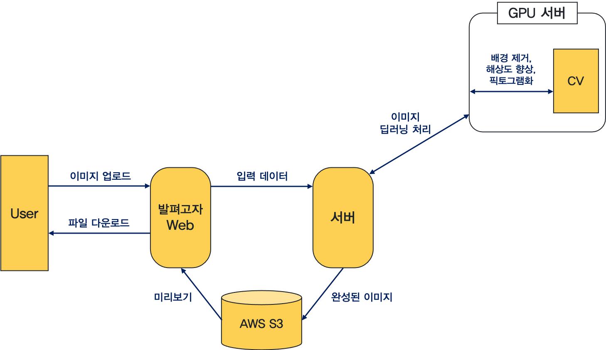
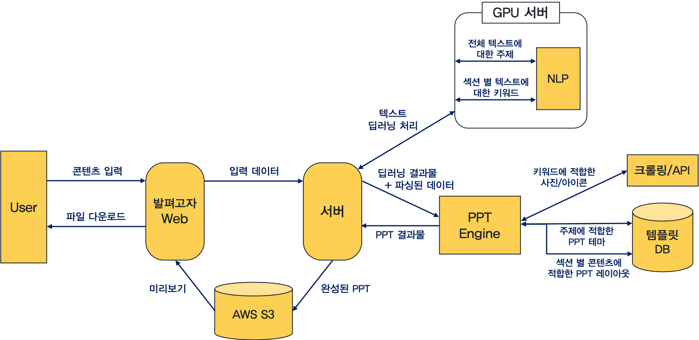
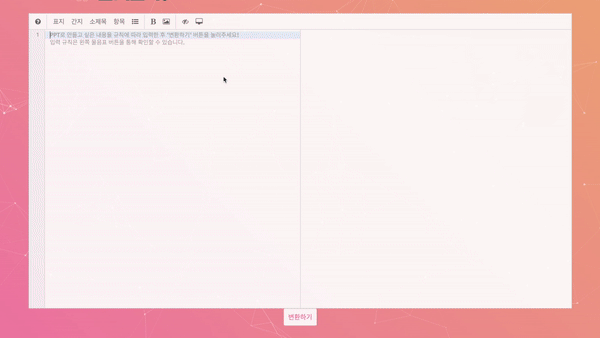
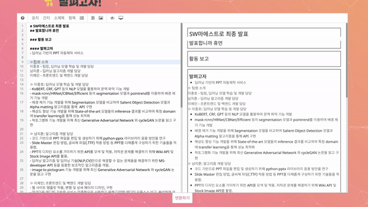
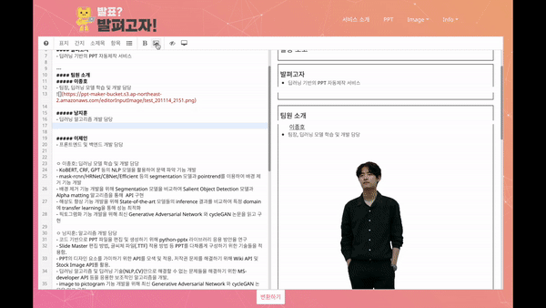
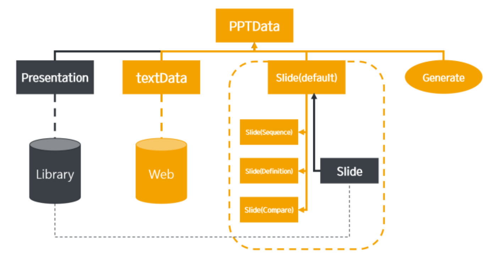

# **딥러닝** 기반의 PPT 자동제작 서비스: **발펴고자**

### SW마에스트로 11기 연수생   **발표합니까 휴먼?** 팀 - **이종호**(팀장)**, 남지훈, 이제인**

 데모 영상

 11기 공식 소개 영상

---

### 프로젝트 요약

- 사용자가 입력한 텍스트와 이미지에 적합하게 AI가 완성된 PPT를 생성한 후 제공하는 서비스

  [🔗 서비스 이용해보기](http://goja.ai)  

- 웹사이트에서 사용자가 텍스트와 이미지를 입력하면, **딥러닝 기술 (자연어처리와 컴퓨터비전)** 을 통해 내용을 분석하여 **맥락과 어울리도록** PPT 자료를 구성, 사용자가 **완성된 파일을 다운로드** 받을 수 있도록 한다.

### 사용자 시나리오 및 시스템 구성도
- 컴퓨터비전 기술 기반의 이미지처리 기능
    
    1. 사용자가 웹에서 배경 제거, 해상도 향상, 픽토그램화 처리하고자 하는 이미지를 업로드한다.
    2. 사용자가 START 버튼을 누르면 서버에서 이미지를 딥러닝 처리한다.
    3. 사용자가 완성된 이미지를 확인한 후, 필요하다면 선호도에 맞추어 세부사항 을 조절하여 이미지를 다운로드한다.
        - 슬라이더 기능을 통해 배경이 제거되는 정도를 조절할 수 있다.
        - 돋보기 기능을 통해 해상도의 향상 정도를 비교 분석할 수 있다.
- 자연어처리 기술 기반의 PPT 생성 기능
    
    1. 사용자가 웹에서 PPT로 만들고자 하는 콘텐츠를 입력한다.
        - 제시된 규칙에 따라 마크다운 형식으로 텍스트를 입력한다.
        - 편리한 GUI의 에디터를 제공하여 누구나 쉽게 입력할 수 있게 한다.
        - 사용자가 필요하다면 선택적으로 이미지를 입력한다.
    2. 사용자가 변환하기 버튼을 누르면 서버에서 PPT를 생성한다.
        1) 텍스트 콘텐츠에 대해 딥러닝 분석을 거친다.
        2) 주제와 어울리는 테마를 적용하고, 섹션 별로 내용에 맞는 레이아웃을 결정하여 슬라이드를 구성한다.
        3) 필요하다면 각 섹션의 키워드를 추출하여 사진이나 아이콘을 추가한다.
    3. 사용자가 선호하는 PPT를 다운로드한다.
        - 제공된 다양한 결과물들 중 사용자는 원하는 결과물을 선택한다.
        - 완성된 PPT 파일을 다운로드 받을 수 있는 버튼을 제공한다.

### 적용 기술
* **Web Front & Server**  
JavaScript, Python Flask, AWS
* **NLP**  
Keyword Extraction, Named Entity Recognizing, Text Classification / KoBERT
* **CV**  
Background Removal - Semantic Segmentation, Salient Object Detection, Alpha matting 
Super Resolution - Residual Dense Network, Generative Adversarial Network 
Image to Pictogram - Semantic Segmentation, CycleGAN, Pix2Style2Pix
* **PPT**  
Microsoft-Developer API

---
## 주요 기능 및 수행 방법

### 1. 컴퓨터비전 기술 기반의 이미지처리 기능
#### 가. 이미지 배경 제거 (Background Removal)
  - 이미지 속 주요한 객체를 제외한 배경 제거
  - 사용자가 배경이 제거되는 정도를 조절하여 결과 출력

  

  > Segmentation, Salient Object Detection, Alpha matting 등의 딥러닝 알고리즘과 컴퓨터 비전 기법을 이용

#### 나. 이미지 해상도 향상 (Super Resolution)
  - 저해상도 이미지를 고해상도 이미지로 변환
  - 웹에서 돋보기 기능을 통해 변환된 이미지 비교

  

  > Residual Dense Network, Generative Adversarial Network 활용

#### 다. 이미지의 픽토그램화 (Image to Pictogram)
  - 학습된 딥러닝 알고리즘을 통해 실사 이미지를 픽토그램으로 변환

  

  > 직접 정제한 데이터셋을 CycleGAN, Pix2Style2Pix 알고리즘에 학습함

### 2. 자연어처리 기술 기반의 PPT 생성 기능
#### 가. 웹 기반의 콘텐츠 입력
  - 사용자가 PPT로 만들려는 텍스트와 이미지를 입력함
  - 실시간 미리보기를 통해 슬라이드 구조를 파악할 수 있음

  
  
  

  > 마크다운 에디팅 기술을 활용하여 사용자 의도 반영 

#### 나. NLP(자연어처리) 기술을 활용한 문맥 파악
  - 키워드를 추출하여 이에 해당하는 이미지/아이콘 검색
  - 주제와 매칭되는 디자인 템플릿 선정

  

  > 주제 별 여러 템플릿을 사전 정의하여 매칭되는 디자인을 베이스 템플릿으로 선정

  > 한국어 데이터셋에 학습된 koBERT 모델을 활용하여 Keyword Extraction, Named Entity Recognizing 기능 수행

#### 다. MS-developer API를 통해 .pptx 파일 작성
  - 선정된 템플릿의 레이아웃에 맞춰 텍스트와 이미지를 배치

  

  > 글꼴, 크기, 배치 및 구성 등을 Python 코드로 지정하여 MS-developer API를 통해 변환
#### 라. 완성된 결과물 제공
  - 다수의 결과물 중 원하는 파일 선택 가능
  - 완성된 .pptx 파일을 다운로드
  > AWS S3와 연동하여 다운로드 링크로 이동

