# **딥러닝** 기반의 PPT 자동제작 서비스: **발펴고자**

## SW마에스트로 11기 연수생  **발표합니까 휴먼?** 팀 - **이종호**(팀장)**, 남지훈, 이제인**


### 프로젝트 요약

- 사용자가 입력한 텍스트와 이미지에 적합하게 AI가 완성된 PPT를 생성한 후 제공하는 서비스

- Flask 기반 웹사이트에서 사용자가 텍스트와 이미지를 입력하면, 딥러닝 기술 (자연어처리와 컴퓨터비전)을 통해 내용을 분석하여 맥락과 어울리도록 PPT 자료를 구성, 사용자가 완성된 파일을 다운로드 받을 수 있도록 한다.

### 기획 의도

- 고품질 PPT의 빠른 작성을 위해 **단순 반복 작업을 대신 해줄 인공지능 기술**이 필요함.

- 텍스트와 이미지 입력만으로 완성된 PPT를 생성하는 서비스 기획
    - 딥러닝과 python 라이브러리를 통해 맥락을 이해하고 단순, 반복 작업을 컴퓨터가 수행하도록 함.
    - 자연어처리, 영상처리, 이미지 크롤링 등의 기술을 접목한 품질 높은 PPT 문서 생성
    
- 기존 PPT 관련 서비스들은 PPT 템플릿, 이미지, 다이어그램 등의 디자인적 요소들을 제공하여 사용자를 보조해주는 기능으로 그쳤으나, 본 서비스는 **보조를 넘어 편집의 자동화를 목적으로** 하여, 사용자가 만들고자 하는 자료를 입력만 하면 **딥러닝 기**술을 통해 이 내용을 분석하여 맥락과 어울리도록 **완성된 PPT 자료를 제공**함.
- 결정적으로, 기존 서비스는 각 슬라이드에서 사용자가 선택하는 한계로 결국 문서를 사용자가 직접 작성해야 하나, 본 서비스는 **사용자의 에디터 입력만으로 완성된 PPT 문서를 생성**하여 제공하므로 PPT의 작성과 제공에 있어 차별이 뚜렷하게 존재함.

### 사용자 시나리오

1. 사용자가 웹에서 PPT로 만들고자 하는 **콘텐츠 입력**한다.
   - 제시된 규칙에 따라 마크다운 형식으로 텍스트를 입력한다.
   - 편리한 GUI의 에디터를 제공하여 누구나 쉽게 입력할 수 있게 한다.
   - 사용자가 필요하다면 선택적으로 이미지를 입력한다.

2. 사용자가 변환하기 버튼을 누르면 서버에서 **PPT를 생성**한다.
   1. 콘텐츠의 내용에 대해 **딥러닝** 분석을 거친다.
   2. **주제와 어울리는** 테마를 적용하고, 섹션 별로 **내용에 맞는** 레이아웃을 결정하여 슬라이드를 구성한다.
   3. 필요하다면 각 섹션의 **키워드를 추출**하여 사진이나 아이콘을 추가한다.

3. 사용자가 선호하는 **PPT를 다운로드**한다.
   1.  제공된 다양한 결과물들 중 사용자는 원하는 슬라이드를 선택한다.
   2. 선택한 슬라이드들을 병합하여 완성된 PPT 파일을 다운로드 받을 수 있는 버튼을 제공한다.

### 시스템 구성도 및 적용 기술

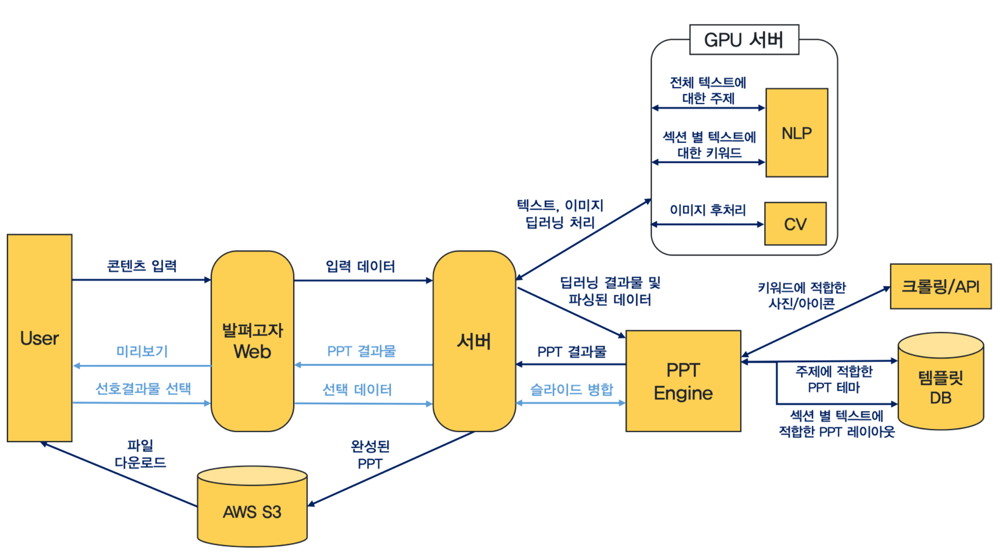

* **Web Front**:  HTML, CSS, JavaScript, Bootstrap
* **Server**:  python Flask, AWS, HTTP, ajax
* **NLP**:  keyword extraction, named entity recognizing, text classification / KoBERT, CRF
* **CV**:  background removal, super resolution, image to pictogram / MaskRCNN, PointRend, Iconify
* **PPT**:  python-pptx


## 주요기능 및 수행 방법

### 1. 마크다운 에디팅 기능

* 사용자가 **웹**에서 마크다운 형식으로 **텍스트, 이미지** 입력 → HTML값 추출하여 서버로 전송 → 입력된 **구조**에 맞게 PPT 생성
  * PPT로 만들고 싶은 컨텐츠를 입력할 때 어떤 내용이 한 슬라이드로 묶이는지, 어떤 단어를 강조할지 등 사용자가 원하는 구조가 있을 것임
  * 따라서 마크다운 형식으로 구조 정보를 입력할 수 있는 기능 제공
* 사용자에게 입력 규칙을 설명해주고, 그에 따라 작성하면 결과물에서 슬라이드가 어떻게 묶일지 뷰어를 통해 보여줌
  * 입력 규칙
    * h1: PPT 전체 제목
    * h2: 부제목
    * h4: 각 슬라이드 위에 배치되는 제목
    * 나머지: 슬라이드 속 내용
    * 엔터를 쳐줘야 슬라이드가 끊어진다. ...등
  * 예시
    * 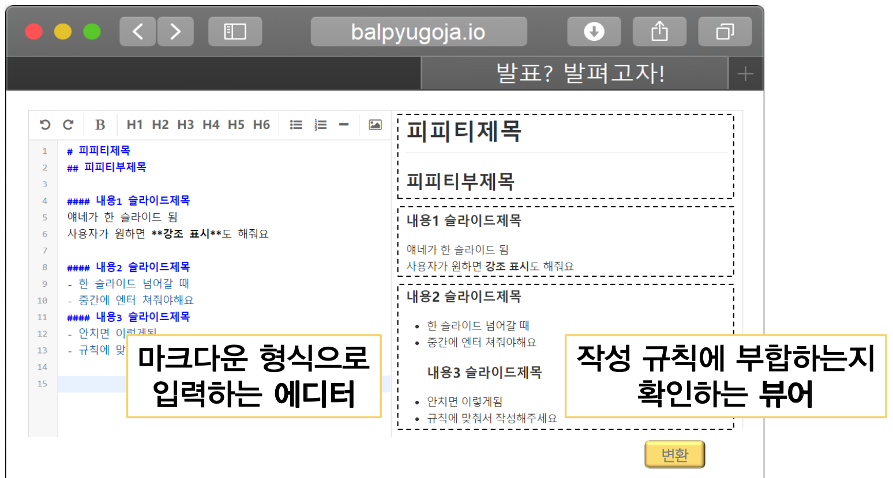	
    * 예시 입력 마지막 부분을 보면 엔터를 치지 않아서 ‘내용3슬라이드제목’에 탭이 들어있고, 다음 슬라이드로 안 넘어가고 점선이 내용2와 묶여 있다.
    * 이렇게 뷰어를 통해 사용자는 자신의 의도가 제대로 반영되는지 확인한다.
* 버튼 GUI
  * 

### 2. 이미지 후처리 기능

* 1. Background Removal

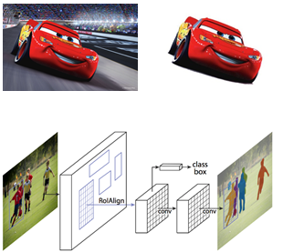

* 2. Super Resolution

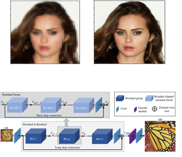

* 3. Image to Pictogram


### 3. PPT 파일 생성 기능

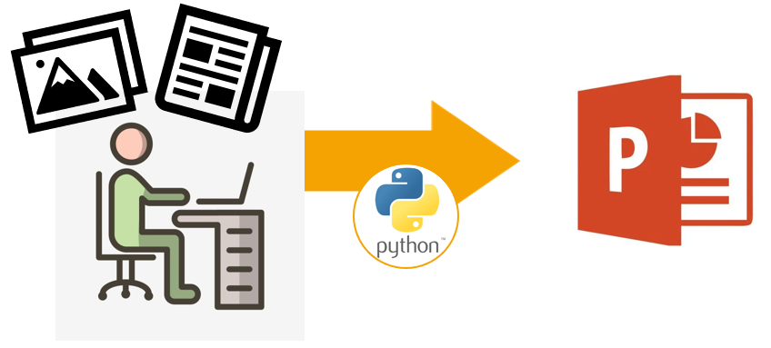

* 추출한 텍스트와 후처리된 이미지를 python-pptx 라이브러리를 이용하여 삽입

### 4. 키워드 및 주제 추출 기능

* koBERT를 이용해 개체명 인식 -> Keywords 추출 -> Topic 선정
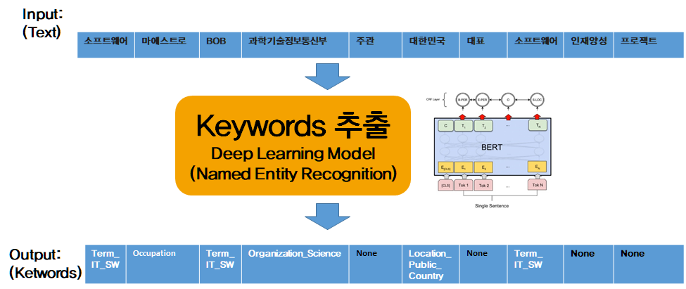


### 5. PPT 미리보기 및 파일 다운로드 기능

* 만들어진 PPT 결과물들을 보여주어 사용자가 원하는 슬라이드를 선택
  * 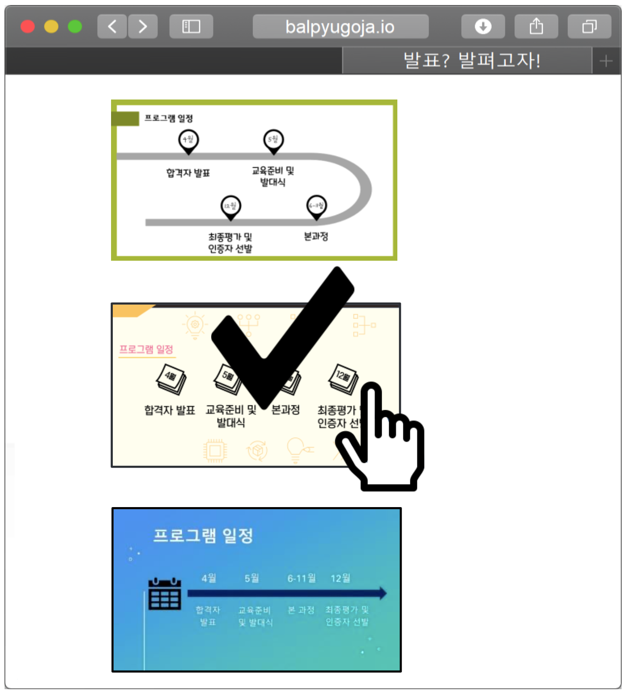
* 완성된 PPT 파일을 AWS S3를 통해 사용자가 다운로드 받음
  * 최종 결과물이 PPT 파일 형식이기 때문에 사용자의 자유로운 수정/활용이 가능


## 현재까지의 개발 성과 및 코드 설명

[시연영상]: https://youtu.be/XjGO-3xnG0g	"시연영상"

### 1. 웹사이트에서의 마크다운 에디팅

* AWS EC2에서 Flask로 웹서버 구현

  * 반응형 웹으로 제작
  * 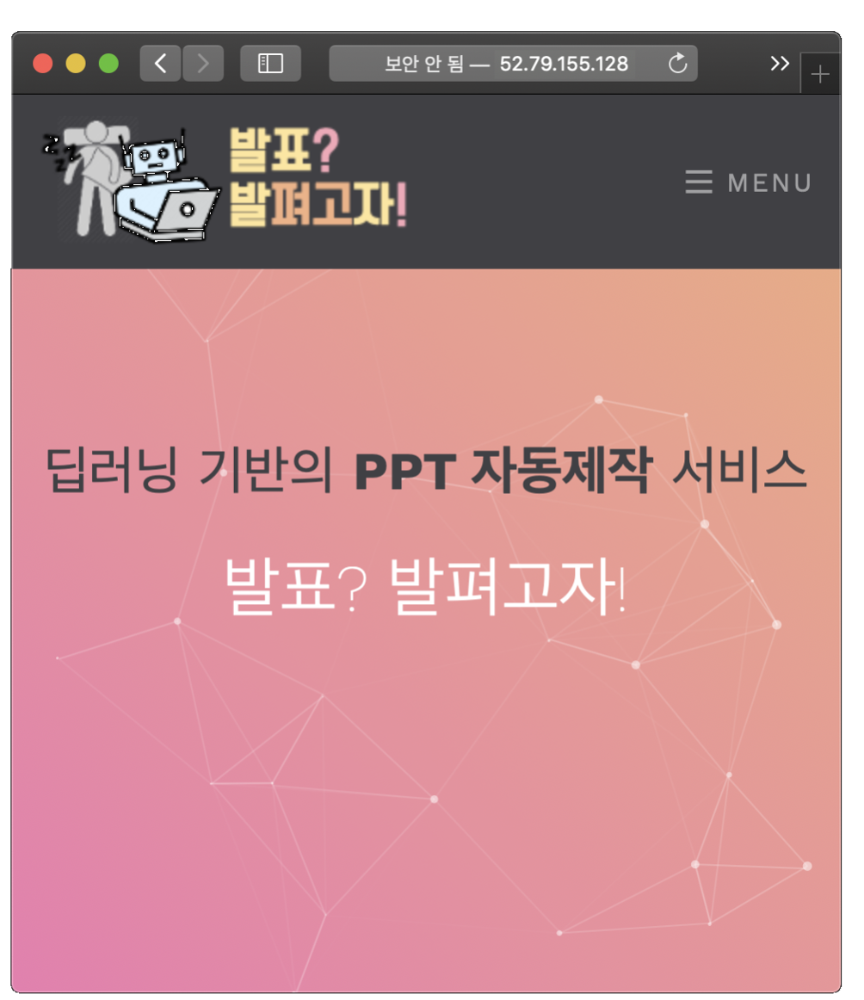

* PPT 만들기 메뉴에 마크다운 에디터를 내장. 사용자는 PPT로 만들고자 하는 텍스트를 입력함.

  * 서비스의 **규칙에 따른 슬라이드 구조**가 사용자의 의도와 맞는지 확인시키기 위해 마크다운 뷰어가 필요
  * 따라서 **에디터와 뷰어가 함께 있는** editor.md 오픈소스 사용
  * 

* 변환하기 버튼을 누르면 에디터의 HTML을 추출하여 ajax를 통해 서버로 전송함

  ```javascript
  // ppt_index.html
  // 변환하기 버튼 javascript
  function submit(){
      $.ajax({
          type : 'POST',
          url : "/ppt",
          data: mdeditorData,
          // ....
  ```

  ```python
  #run.py
  @app.route('/ppt', methods=['POST', 'GET'])
  def ppt():
      # 변환하기 버튼을 누르면 데이터 받아옴
      if request.method == 'POST’:
          # ppt_index.html에서 ajax로 보낸 에디터 내부 html
          mdeditorHtmlStr = request.form.to_dict()['html’]
          # 엔진으로 넘기기
          downloadUrl = pptEngine.convert(mdeditorHtmlStr)
          return downloadUrl
      return render_template('ppt_index.html')
  ```

* 서버는 텍스트 파싱을 통해 적절한 슬라이드 구조로 텍스트 데이터 json 생성, 이를 통해 PPT Engine이 PPT를 만들 수 있게 함

### 2. 컴퓨터비전을 통한 이미지 후처리

* Segmentation Model Performance Comparison
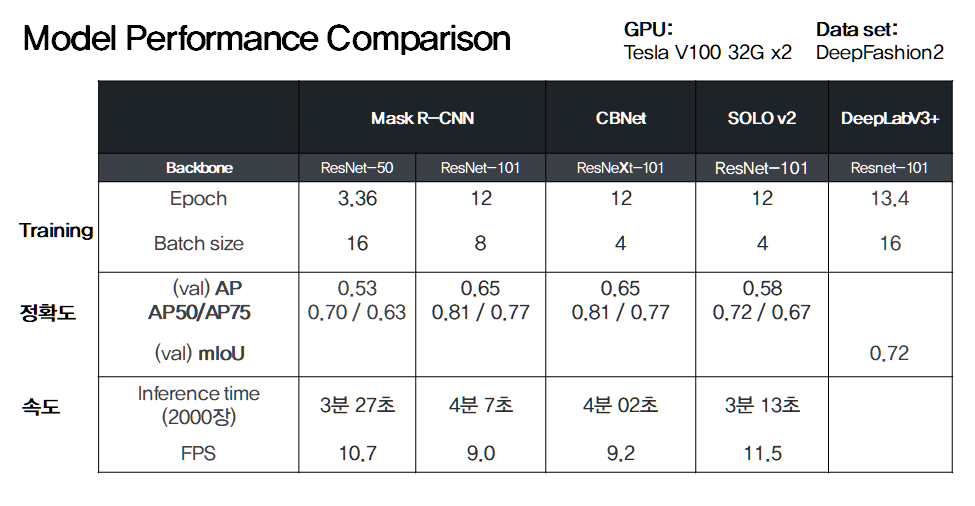

### 3. PPT 파일 생성

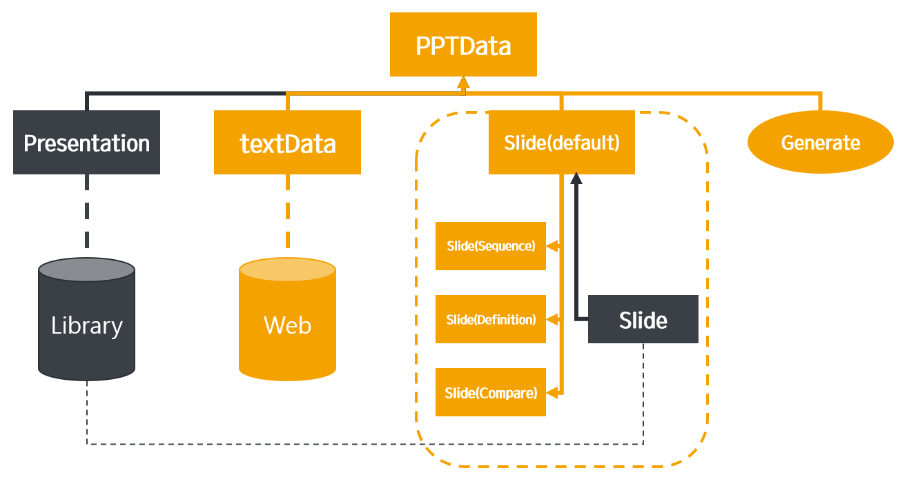

* Python 코드로 파워포인트를 생성하기 위한 기능들의 모듈화.

* PPT 파일, 슬라이드, 텍스트 프레임, 단락 등이 객체화.

* 크기나 모양 등을 조절할 수 있기 때문에 간단히 파워포인트를 구성할 수 있음.

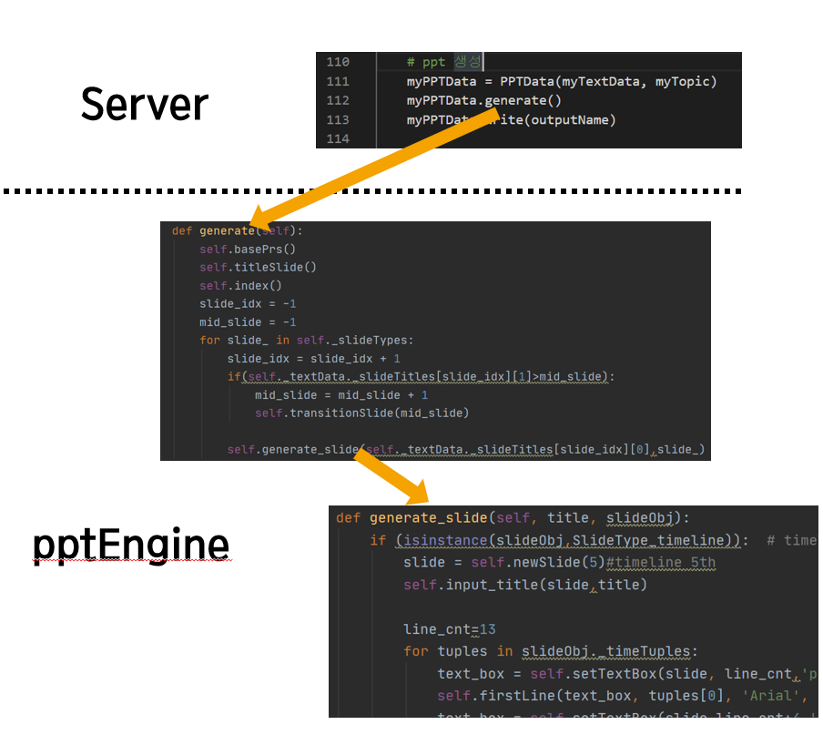

### 4. 자연어처리를 통한 주제 추출

* 텍스트 데이터 json → Keywords, Topic 추출
* Keywords는 TTA Standard (개체명 태그 세트 및 태깅 말뭉치)를 레퍼런스로 삼아
topic이 될 수 있는 90가지의 Class로 재분류
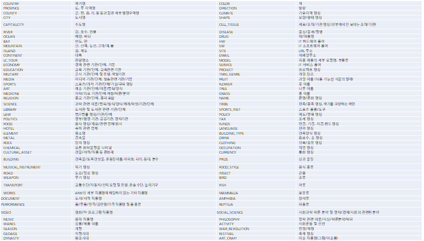

### 5. PPT 파일 다운로드


* 예시 output 

    * 
    
    * 입력 데이터를 딥러닝 서버에서 분석 → ISW(IT Software)로 분류, 관련 템플릿 자동 선정
    * 내용에 맞춰 슬라이드 자동 구성
        * 슬라이드 소제목들로 목차가 자동으로 생성
        * 적절한 위치에 간지(중간 제목 슬라이드) 자동 생성
        * 'SW Maestro?'의 제목을 토대로 **정의 형식** 채택
        * ‘일정'이라는 텍스트에 의해 **시간의 흐름**에 맞춰 구성
        * BoB 와 SWMaestro로 슬라이드 소제목이 분류되어 **비교/대조 형식**이 적용

* 생성된 PPT 파일이 업로드된 AWS S3 링크를 response로 전달. success일 때 링크로 바로 연결되어 자동으로 파일이 다운로드 됨.

    ```javascript
    // ppt_index.html
    // 변환하기 버튼 javascript
    function submit(){
        $.ajax({
            // ...
            success: function(result){
                location.href = result
            },
            error: function(xtr, status, error){
                alert(xtr+":"+status+":"+error);
            }
        });
    }
    ```
    * Python용 AWS SDK인 Boto3을 이용하여 생성된 PPT 파일을 AWS S3에 업로드, 파일의 다운로드 링크를 제공 받음

    ```python
    # convert.py
    def convert(htmlStr):
        #...
        #...
        uploadFileToS3(outputName, ‘outputPPT/’+outputName)
        url = getUrlFromS3(‘outputPPT/’+outputName)
        return url
    
    ```
    ```python
    # awsModule.py
    import boto3
    import botocore
    bucketName = 'ppt-maker-bucket’
    # 파일이 현재 위치한 로컬 경로 -> 업로드하려는 위치의 s3 경로
    def uploadFileToS3(myPath, s3Path):
        s3 = boto3.client('s3')
        s3.upload_file(myPath, bucketName, s3Path)
    # 파일이 현재 위치한 s3 경로 -> 다운로드하려는 위치의 로컬 경로
    def downloadFileFromS3(s3Path, myPath):
        s3 = boto3.resource('s3')
        s3.Bucket(bucketName).download_file(s3Path, myPath)
        
    def getUrlFromS3(s3Path):
        s3 = boto3.client('s3')
        location = s3.get_bucket_location(Bucket=bucketName)['LocationConstraint']
        url = "https://s3-%s.amazonaws.com/%s/%s“ % (location, bucketName, s3Path)
        return url
    
    ```

    


## 앞으로의 개발 계획 및 목표

### 1. 마크다운 에디팅 기능

* PPT 만들기 화면 상단에서 사용자에게 입력 규칙을 설명하긴 하지만, UI/UX 측면에서 좋은 디자인은 아니다.
  * 이를 보완하기 위해 **에디터 내부 버튼들을 서비스에 알맞게 커스텀** 할 예정이다.
  * 예시: h1대신 제목, h2대신 부제목 등의 네이밍이 버튼에 적히도록
* 뷰어에서 **한 슬라이드로 묶이는 부분에 점선을 표시**하여 생성될 PPT의 구조를 사용자에게 직관적으로 보여줄 수 있도록 하려 한다.

### 2. 이미지 후처리 기능

* 1. Segmentation model 선정 후 Pointrend 알고리즘 적용
* 2. RCAN model 적용한 결과 확인
* 3. Iconify: converting photographs into icons 논문 구현
* 4. 위의 기능들 Web에서 구현

### 3. PPT 파일 생성 기능
* PPT 생성을 위한 대부분의 기능들
→ 자체 API의 형태로 이미 모듈화 완료

* 앞으로 추가 이슈는 API 응용으로 충분
→ 추후 개발속도 증진

* 서비스 품질을 위한 이슈
1. 폰트 종류 추가
2. 개행 규칙 개선
3. 템플릿 다양화

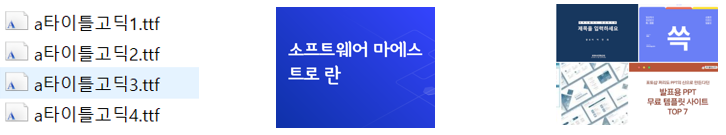

### 4. 키워드 및 주제 추출 기능

* 현재는 BERT(Bidirectional Encoder Representations from Transformers) 의
한국어 finetuning 버전인 koBERT를 이용하여 개체명 인식(keywords 추출)하고
가장 빈도수가 높은 Keyword를 Topic으로 선정하였는데,
추후에는 직접 text 분류기를 구축하여 Topic을 선정할 예정.

### 5. PPT 미리보기 및 파일 다운로드 기능

* 웹에서 입력한 데이터가 PPT로 바로 생성될 수 있는 단계까지 만들어진 pptx 템플릿 데이터는 현재까지는 그렇게 많지 않다.
  * 하지만 **분석해 놓은 슬라이드 데이터**가 많기 때문에 템플릿 데이터를 만드는 일은 시간만 더 들이면 충분히 가능하다.
* 하나의 인풋 데이터에 대해 다양한 레이아웃과 디자인을 **적용한 여러 결과물들을 이미지로 저장**하여 웹에 띄워주는 기능을 추가할 예정이다.
  * ppt에 내장되어 있는 슬라이드를 png/jpg로 내보내기 기능을 이용할 것이다.


### * 후속 활용 방안

* 지원 파일 포맷 확장
  * 문서 파일 포맷(.docx, .hwp 등) 생성 기능을 추가하여 보고서 자동 생성 서비스 추가 제공
  * 스프레드시트 파일 포맷(.xlsx, .cell 등) 추가 지원
* 사용자 입력 다양화
  * 보고서, 논문 등의 다양한 정형화된 데이터를 추가 지원하여 서비스의 적용범위를 확장
  * 회의록, 대본 등의 비정형화 텍스트를 후처리 후 데이터로 활용하여 범용성 및 사용자 편의성을 증대
  * 실시간 화상회의 녹화본을 비롯한 비정형화 음성 파일을 입력데이터로 지원

→ 포스트 코로나 시대의 비대면 화상 모임 수요 증가에 맞춰 화상 모임의 대화 내용을 다양하게 가공하여 문서로 제공하는 통합 서비스 제공